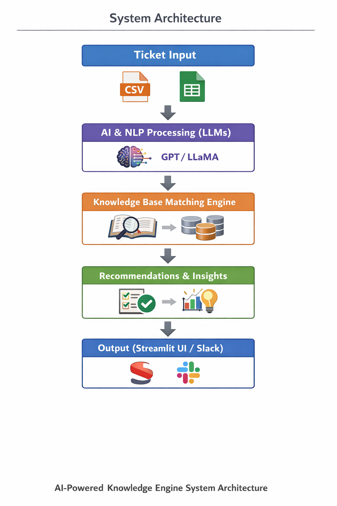

# AI-Powered Knowledge Engine for Smart Support Ticket Resolution

An AI-driven system developed to automate and enhance the resolution of customer support tickets by intelligently analyzing issues and recommending relevant knowledge base solutions.

## 📘 Internship Project Overview

This project was developed as part of an internship submission to demonstrate practical skills in Artificial Intelligence and Python development.The system simulates a real-world customer support environment where incoming tickets are automatically analyzed, categorized, and matched with relevant knowledge base articles. The goal is to reduce manual effort, improve resolution speed, and enhance overall support efficiency.

🎯 Problem Statement
Customer support teams often face challenges such as:
- Manual ticket classification
- Time-consuming search for relevant solutions
- Repetitive issue handling
- Lack of insights into documentation gaps

This project addresses these challenges using AI-based automation.

💡 Solution Approach
The AI-Powered Knowledge Engine:
1. Analyzes support ticket text using NLP techniques
2. Categorizes and tags tickets automatically
3. Matches tickets with existing knowledge base articles
4. Recommends the most relevant solutions
5. Identifies missing or insufficient documentation
6. Provides optional Slack notifications for quick response

✨ Key Features
- 🤖 AI-based ticket analysis  
- 🏷️ Automatic ticket categorization & tagging  
- 📚 Knowledge base article recommendations  
- 🧠 Content gap identification  
- 📊 Google Sheets integration for ticket input  
- 💬 Slack integration for real-time notifications  
- 🧩 Modular and extensible architecture  

🛠️ Technologies Used
- Programming Language: Python  
- AI: Large Language Models (GPT / LLaMA via LangChain / Ollama)
- Data Processing: Pandas, CSV
- APIs: Google Sheets API, Slack API  
- Tools: Virtual Environment (venv), GitHub  

📁 Project Structure

AI-Powered-Knowledge-Engine-for-Smart-Support-Ticket-Resolution/
│
├── project.py                  # Core application logic
├── requirements.txt            # Python dependencies
├── knowledge_base_sample.csv   # Sample knowledge base
├── README.md                   # Project documentation
└── LICENSE                     # MIT License

⚙️ Installation & Setup

1. Clone the repository:
   git clone https://github.com/siri-manvitha/AI-Powered-Knowledge-Engine-for-Smart-Support-Ticket-Resolution.git 

2. Navigate to the project folder:
   cd AI-Powered-Knowledge-Engine-for-Smart-Support-Ticket-Resolution

3. Create and activate a virtual environment:
   python -m venv venv
   source venv/bin/activate   # macOS/Linux
   venv\Scripts\activate      # Windows

4. Install dependencies:
   pip install -r requirements.txt

▶️ Execution
Run the project using:
  '''bash
  streamlit run project.py
  The Streamlit interface allows users to input support tickets and view AI-generated recommendations interactively.

Execution Flow

1. Ticket data is loaded
2. AI analyzes ticket content
3. Relevant knowledge base articles are identified
4. Recommendations are generated
5. Output is displayed or sent via Slack

📊 Dataset Details
knowledge_base_sample.csv
  * Contains sample support articles
  * Used to simulate real-world knowledge base matching
  * Easily replaceable with custom datasets

🧠 System Architecture (High-Level)

## 🧠 System Architecture

🔄 Agile & Internship Context
1. Methodology: Agile (Scrum)
2. Internship Program: Infosys Springboard 6.0
3. Development Approach: Iterative feature development across sprints
4. Focus: Real-world AI application and integration

📈 Learning Outcomes
Through this project, I gained hands-on experience in:
* Applying AI and NLP to real-world problems
* Working with Large Language Models
* Building modular Python applications
* Integrating third-party APIs
* Designing scalable support automation systems

🚀 Future Enhancements
* Web-based user interface
* Advanced analytics dashboard
* Multi-language ticket support
* Database-backed storage
* Model fine-tuning for improved accuracy

📜 License

This project is licensed under the MIT License.

👩‍💻 Author
Siri Manvitha
Internship Project Submission

⭐ This project demonstrates practical application of AI and Python concepts in a real-world support automation scenario.

